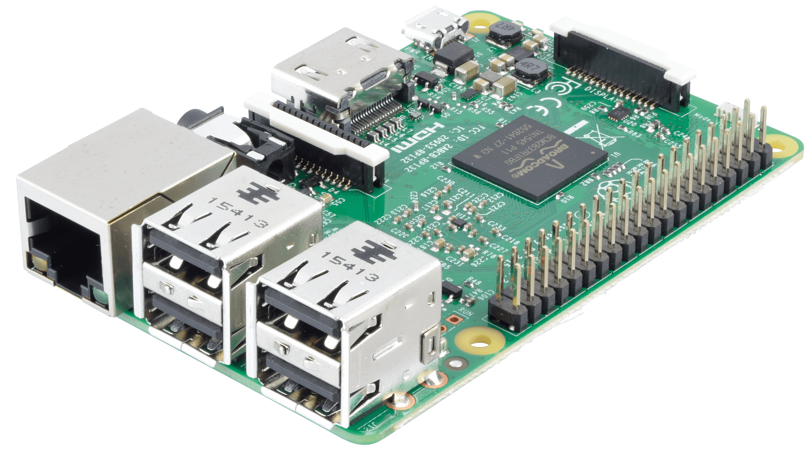

# Configuration Raspberry PI (3 B+)

Pour la communication entre l'arduino et le Raspberry Pi 3 nous optons pour un liaison série avec le protocol UART

//// Configuration PI /////

--se connecter à PI en ssh--

sudo -i

apt update
apt upgrade

apt install python-pip
pip install pyserial
pip install requests

nano /boot/config.txt

--ajouter ces lignes à la fin du fichier--

dtoverlay=pi3-disable-bt
enable_uart=1

nano /boot/cmdline.txt

--supprimer la ligne suivante--

console=serial0,115200

--redémarrer la PI--

reboot

--se re-connecter à PI en ssh--

sudo -i
cd /opt
mkdir py
cd py

--Récupérer le scripte python--

https://github.com/CPELyon/projet-iot-5a-2019-2020-cpetech/tree/master/gateway-code/Raspberry_PI/Python

python serial.py

